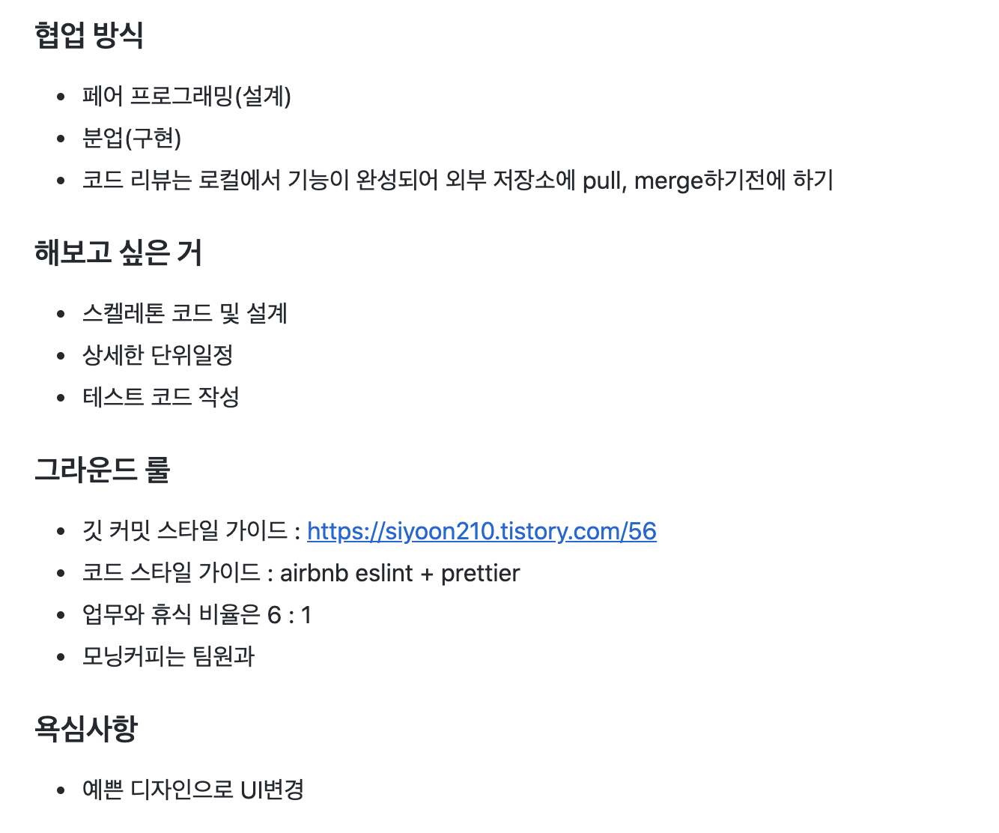

### 우아한

우아한 테크캠프 2번째 과제를 하며 겪었던 경험과 위기 그리고 배운 점과 아쉬운 점을 정리해보고자 합니다.

## Ground Rule

새로운 팀원인 현욱님과 정한 저희 팀의 그라운드 룰입니다. 설계 후 첫번째 사이클까지 페어 프로그래밍으로 진행하고 다음 부분부터 분업으로 하기로 한 내용이 눈에 띕니다. 일관성있는 코드를 작성하기 위해서 다음과 같은 방향을 제시했는데 현욱님이 흔쾌히 응해주셔서 너무 감사했습니다.



이와 같은 룰을 토대로 저희는 차근차근 작업을 진행했는데요. 생각보다 위기는 빨리 찾아왔습니다.

### 위기 #1 - 주변 팀들과의 비교

차근차근 같이 설정하고, DB설계를 하던 어느날, 다른 조들의 진행속도가 눈에 들어오기 시작했습니다. 드래그 앤 드랍이 완성되었다는 소식이 점점 들려오기 시작했을 때부터, 제 맘은 조급해지기 시작했습니다. 우린 아직 설계도 마무리하지 못했는데 말이죠. 다행스럽게도 현욱님이 제 마음을 잡아주셔서 끝까지 구조 잡고 프로젝트를 시작할 수 있었습니다. 그래도 조급해하던 저를 위해 일요일에 나와주셔서 너무 감사했어요 ㅎㅎ

### 위기 #2 - 설계의 문제점

드래그앤드랍을 하면서 이야기를 나눴던 부분은 다음과 같습니다.

1. 각 컴포넌트가 데이터를 가지고 있지 말고, Redux처럼 하나의 전역변수를 통해 관리하자
2. 각각 카드에서 발생된 이벤트는 카드 컴포넌트에서 처리하자
3. 변경이 필요할 시 전역변수를 통해 새로 그려주자

그 결과로 작성된 Drag And Drop의 코드 중 일부를 보여드리겠습니다.

```jsx
// dragAndDrop.js

static onEnterOtherCard(e, card) {
  this.setEnteredCard(card);
  this.setDummyCardDirection(e, card.element);
  this.pushCardInfo();
  this.enteredColumn.update();
  this.addClassToDummyCard(card);
}

// card.js
setEventListener() {
  this.setMouseDownEvent();
  this.setMouseEnterEvent();
  this.setMouseLeaveEvent();
  this.setMouseMoveEvent();
}

removeEventListener() {
  this.removeMouseEnterEvent();
  this.removeMouseDownEvent();
  this.removeMouseLeaveEvent();
  this.removeMouseMoveEvent();
}

update() {
  this.remove();
  this.render();
}

remove() {
  this.removeEventListener();
  var child = this.element.lastElementChild;
  while (child) {
    this.element.removeChild(child);
    child = this.element.lastElementChild;
  }
}
```

1. 노트가 드래그가 시작되면 DraggedNote라는 변수에 저장합니다.
2. 드래그 된 노트가 다른 노트 영역으로 들어갔을 때, EnteredCard라는 변수에 저장합니다.
3. Note Data를 모두 담고 있는 전역변수 columnData를 수정합니다.
4. 마우스 Position을 따라 dummy card가 삽입될 방향을 계산합니다.
5. 수정된 카드가 포함된 칼럼내의 모든 카드 Element의 이벤트 리스터를 지운 뒤 삭제합니다.
6. columnData를 토대로 다시 Card Element를 만든 뒤 칼럼영역에 추가합니다.
7. 카드에 이벤트 리스너를 추가합니다.

위와 같은 코드의 문제점은 금방 나타났습니다. 첫 번째로 수정에 대한 비용이 너무 비쌌고 자주 일어났습니다. 노트가 드래그되어 다른 노트영역으로 들어갈 때마다 이벤트가 발생되었거든요..

두 번째로 이벤트가 일어났을 때의 과정이 너무 복잡하고 어려웠습니다. 칼럼에 대한 이벤트를 추가하자마자 생각지 못한 버그들로 인해 진행이 어려웠습니다. (mouse down → column enter → card enter → card leave .....)

### 다시 시작하자

현욱님과 대책회의를 한 결과 기존 코드를 살리기 어려울 것 같다는 결론에 도달했습니다. 그래서...

2박3일 동안 붙잡고 있던 코드들을 다 날리고 새로 짜기 시작했습니다. 새로운 Rule은 다음과 같습니다.

1. 컴포넌트는 그리는 것에만 집중!
2. 이벤트는 Drag and Drop 내에서만 처리. 이벤트 위임을 사용해서 최상단 컴포넌트에만 이벤트 리스너 적용
3. 업데이트는 최소화하여 변경이 필요할 경우에 한번만!

그 결과 나온 코드는 아래와 같습니다.

```jsx
static onMouseUp(e) {
  this.updateCardOrder();
  this.updateCardElementId();
  this.insertDraggedCard();
  this.clearDraggedCard();
  this.clearDummyCard();
};
```

1. 전역변수에서 카드 순서를 업데이트 합니다.
2. 드래그 중인 카드의 ID를 업데이트 합니다.
3. 변경된 위치에 삽입합니다.
4. draggedCard 변수를 초기화 합니다.
5. 삽입될 위치를 보여줬던 dummyCard를 삭제합니다.

다행스럽게도 조금 더 이해하기 쉽고, 예상한대로 동작하는 코드가 완성되었습니다. 기존 코드를 살리기 위해 노력하는 것보다 처음부터 다시 짜는 게 더 효과적일수 있다는 것을 배울 수 있었습니다.

### 급 마무리

드래그 앤 드랍이 완성 된 후 저희에게 남은 시간은 하루 반이 전부였습니다. 마지막 밤을 세고 시연 30분 전까지 코딩에 매달려있었지만.. 전체 기능은 다 구현하지 못한 채 마무리가 됬습니다.
